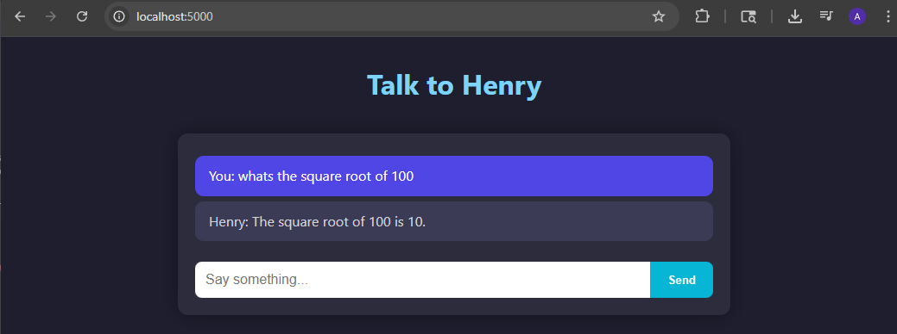

# 🧠 Henry — Local AI Chatbot using LLaMA.cpp

**Henry** is a fast, local-first AI chatbot built with Flask and [`llama.cpp`](https://github.com/ggerganov/llama.cpp). It runs quantized LLMs on your machine using the GGUF format — no cloud APIs, no data leaving your device.



---

## ✨ Features

- 🏃‍♂️ Runs fully offline with quantized `.gguf` models
- 🧠 Powered by [llama-cpp-python](https://github.com/abetlen/llama-cpp-python)
- 💬 Flask web UI with real-time chat
- 🔄 Easily swap LLM models (like TinyLLaMA or Zephyr)
- 🎨 Clean and customizable frontend

---

## 🚀 Getting Started

### 1. Clone the repository

```bash
git clone https://github.com/heavyburnin/henry.git
cd henry-chatbot
```

### 2. Set up a Python virtual environment

```bash
python3 -m venv venv
source venv/bin/activate
pip install -r requirements.txt
```

### 3. Download and build `llama.cpp`

```bash
git clone https://github.com/ggerganov/llama.cpp
cd llama.cpp
mkdir build && cd build
cmake ..
cmake --build . --config Release
cd ../..
```

### 4. Download a model (GGUF format)

Pick a quantized `.gguf` model from Hugging Face:

- [TinyLLaMA](https://huggingface.co/)
- [Zephyr](https://huggingface.co/)

Put it in the `models/` folder:

```
henry-chatbot/
└── models/
    └── zephyr-7b-alpha.Q2_K.gguf
```

### 5. Run the app

```bash
python app.py
```

Visit: [http://127.0.0.1:5000](http://127.0.0.1:5000)

---

## 🧠 Tips & Troubleshooting

- ❄️ **App stuck loading after POST?** Your model might be too large. Try a smaller quant like `Q2_K`.
- 🔠 **Getting `<UNK>` tokens?** Your tokenizer may not match the model — prefer chat-tuned GGUFs.
- 🐢 **Slow inference?** Try disabling debug mode or reducing `n_ctx` in `model_runner.py`.

---

## ⚙️ Requirements

- Python 3.8+
- CMake 3.16+
- A C++17-compatible compiler (GCC, Clang, etc.)
- 4–8 GB RAM (minimum for smaller models)

---

## 📜 License

This project is licensed under the MIT License.  
Use at your own risk, and always check licenses of the models you download.

---

## 🙏 Acknowledgements

- [llama.cpp](https://github.com/ggerganov/llama.cpp) by Georgi Gerganov
- [llama-cpp-python](https://github.com/abetlen/llama-cpp-python)
- Hugging Face model authors for open LLMs

---

💬 Feel free to open issues or submit a PR!
